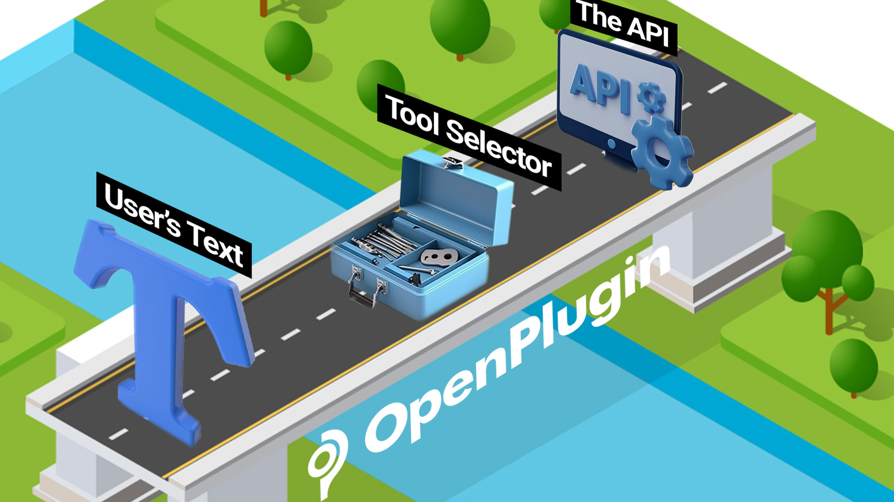

=========================
Host Plugins
=========================

.. toctree::
    :titlesonly:

    getting_started
    plugin_selector_api
    run_plugin_api

Who is this project for?
========================

This project is for plugin platform providers (i.e., those who want to create a container / execution environment that run the plugins). This is a Service Provider interface. In other words, we’re clearly separating ‘those who create plugins’ from ‘platforms that run plugins’. If your an application developer wanting to create a plugin, this project is likely not for you. But, you should be ensuring that the plugin framework you choose has an OpenPlugin interface.

The Problem Statement
=====================

Here’s a quick overview of the problem from a developer’s viewpoint:

When people give instructions to an LLM (via chat, etc.), they use a variety of ways of describing what they want. Some technology (the tool selector) must determine what the intent of the command was (aka, intent detection). Additionally, the command might have some extra data like “in the morning”, “once per week”. All of this natural language needs to be mapped back to an API. The Tool Selector must do more than just ‘find the right tool’, it must map language to an API and call it perfectly.

So, here we go. Given J variations of sample input text, and K variations of "installed" plugins, use a Tool Selector. Then, evaluate the performance:

1. Is the correct plugin selected?
2. Is the correct API operation selected?
3. Are the API parameters filled in correctly?
4. What was the cost to solve?
5. And, what was the round-trip latency?
   If the developer is using a composable tool selector like LangChain,  we add the following considerations:
6. How do the accuracy, cost and latency metrics change, when you swap out LLM providers & models (Palm2, GPT4, Cohere Command, etc.)

Approaches to Solving the Problem
=================================
Using NLP terms, we’d describe the problem as ‘intent detection’ + ‘slot filling’. And normally, this would be accomplished by building/fine-tuning a model specifically for your task. But with LLMs, developers are also just asking the LLM to solve the problem. There are pros and cons to the various approaches.

T = Tool / plugin Selection

O = Operation Selection

P = Parameter Filling

**Style 1:** T=LLM, O=LLM, P=LLM, <Invoke API>, Results fed back to LLM

- The LLM is fed a list of ‘installed plugins’ and the user’s text.
- The LLM is asked to decide which plugin/operation to use
- The LLM slot fills the parameters and generates the calling code
- The code is run; the results are either returned as-is, or are sent back to the LLM to be ‘prettified’

**Style 2:** T=Embeddings, O=LLM, P=LLM, <Invoke API>, Results fed back to LLM

- Same as Style 1, but Embeddings or another ‘fast semantic matching technique is used for the ‘selector’ function.

**Style 3:** T, O, P = Fine Tuned LLM, <Invoke API>, Results fed back to LLM

- The LLM is fine tuned with training data that shows mappings between sample commands and the matching / resulting API calls.

**Style 4:** T, O, P = Single Task Model, <Invoke API>, Results fed back to LLM

- A specialized, single task model is built to solve the problem. Similar to Style 3, the model is trained with your data, but on a more focused / specialized level, reducing the number of runtime inferences.

**Style 5:** Something else?

- There are lots of ways to solve this problem. It’s still early-days and the best/right approach is likely still ahead of us!!

Standardizing the Interface for Tool Selection
==============================================
Developers want to create plugins that are consistently accurate and have low latency. And they want to avoid manually rewriting, redeploying and retesting their plugins across providers. If there was only one plugin hoster, it would be a trivial problem. But, as the number of chat sites/apps increases, quality assurance becomes a significant issue.

For this reason, we’re introducing a standard interface to test plugins / tools:

- LLM Tool Selector API (Docs) (OpenAPI JSON)

And bindings / SDK’s:

- LangChain Binding

Tool Selectors & Use with LLMs
==============================

Large Language Models (LLMs) are able to provide analysis on a wide range of tasks. However, there are certain limitations. In some cases, the LLMs do poorly on multi-step tasks such as solving complex mathematical problems or analyzing a complex business problem. It is also common for the LLM to need access to data that resides inside of a database, or application. In such cases, the LLM would be fed data called by an API or a query (SQL, etc.).

Hence, there is a need to create a bridge between a user’s text, the LLM, and a structured interface like an API. These bridges go by different names. OpenAI calls them Plugins, LangChain calls them Agents, and the academic research will often call them tool selectors. Regardless of the name, the concept remains the same, and for LLMs to succeed in most complex tasks, it is essential to have a highly performant solution.

Hosted Tool Selector API Providers
==================================
For demo purposes only, we’re hosting an instance of the Tool Selector API. To use the service, you’ll need to get a key from jeffrschneider[at]gmail[dot]com

The service will limit the number of calls you can make. If you’re interested in either having a 3rd party run this as a managed service or being a managed service provider, let us know.
