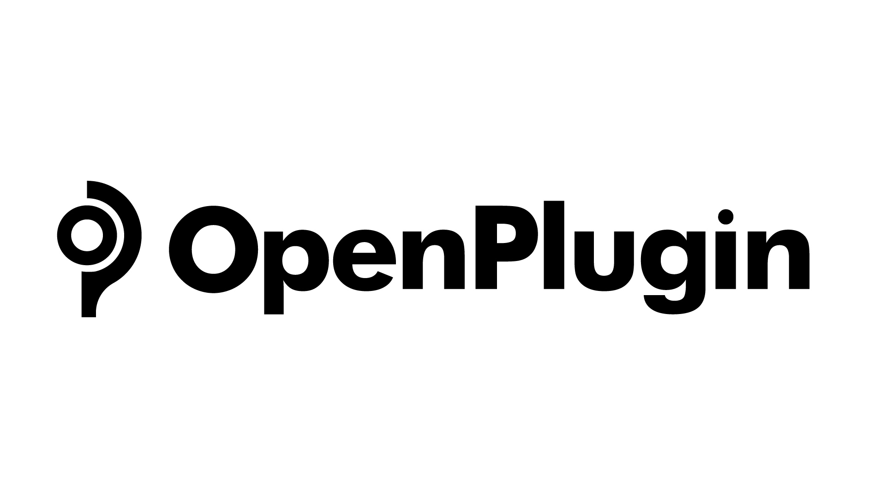

======================
Documentation
======================

Summary
=========================
This project aims to provide a standardized way to define the configuration and metadata of plugins that can be used by the tool selector service. The project introduces the openplugin manifest file format, which allows developers to specify properties and settings for their plugins such as name, version, dependencies, and supported platforms. This format enables seamless integration with the tool selector service.

The project also addresses the problem of mapping natural language instructions to API calls. It involves using a tool selector to determine the intent of the command and map it to an API. The project evaluates the performance of the tool selector in terms of selecting the correct plugin, selecting the correct API operation, filling in API parameters correctly, and the cost and round-trip latency of solving the problem. Different approaches are explored, including using language models (LLMs) for intent detection and slot filling, embeddings for semantic matching, and fine-tuning LLMs with training data.

The project also introduces a standardized interface for tool selection, the LLM Tool Selector API, along with bindings and SDKs. It emphasizes the need for a bridge between user text, LLMs, and structured interfaces like APIs. The project provides a hosted instance of the Tool Selector API for demo purposes, with limitations on the number of calls. There is also a possibility of running the service as a managed service or becoming a managed service provider.

Overall, this project aims to simplify plugin development and improve the accuracy and performance of tool selection by providing a standardized interface and evaluating different approaches to mapping natural language to API calls.

Terminology
=========================
Unfortunately, as this is an emerging space, there are lots of competing terms floating around. Specific to this project, here are the definitions we’re using:

**1. Plugin**
First, it’s assumed that we mean “an LLM plugin”. A plugin is the technology an end user would add to a chat app or similar to leverage 3rd party tools like APIs.

**2. Plugin Manifest**
This is the metadata associated with a plugin that users or programs can view to determine how to install it, and call it.

**3. Tool Selector**
This refers to solutions that execute the natural language and map it to an API. Typically this is done by a platform vendor (Microsoft, Google, HuggingFace) or a library (LangChain, Imprompt).

**4. Tool Selector API/ Bindings**
The process of mapping natural language to a tool can be modularized, and made a dedicated task. This task can be called via a RESTful API call, or locally via a language specific binding (SDK).

.. toctree::
    :titlesonly:

    plugin_developers/index
    plugin_platform_providers/index
    Github Repo <https://github.com/LegendaryAI/openplugin>

.. important::

    This documentation was generated on |today|.

