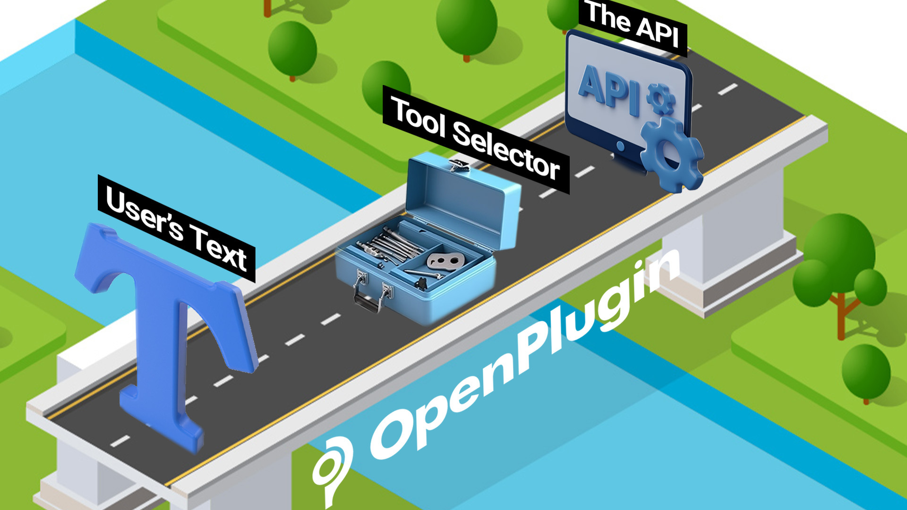

==================================
Overview
==================================

Tool Selectors & Use with LLMs
================================

Large Language Models (LLMs) are able to provide analysis on a wide range of tasks. However, there are certain limitations. In some cases, the LLMs do poorly on multi-step tasks such as solving complex mathematical problems or analyzing a complex business problem. It is also common for the LLM to need access to data that resides inside of a database, or application. In such cases, the LLM would be fed data called by an API or a query (SQL, etc.).

Hence, there is a need to create a bridge between a user’s text, the LLM, and a structured interface like an API. These bridges go by different names. OpenAI calls them Plugins, LangChain calls them Agents, and the academic research will often call them tool selectors. Regardless of the name, the concept remains the same, and for LLMs to succeed in most complex tasks, it is essential to have a highly performant solution.

Hosted Tool Selector API Providers
=======================================
For demo purposes only, we’re hosting an instance of the Tool Selector API. To use the service, you’ll need to get a key from jeffrschneider[at]gmail[dot]com

The service will limit the number of calls you can make. If you’re interested in either having a 3rd party run this as a managed service or being a managed service provider, let us know.

